# gem5bench-result

This project contains a single python script `main.py` to process the output of the gem5 simulator.
The result of this processing is a bunch of `.perf` files, which will be used by [BarGraphGenerator](https://gitlab.com/JianpingZeng/BarGraphGenerator) to generate neat `.pdf` figures.

This project is just a demo. You need to understand and modify the contents of `main.py` for customized usage, but normally you will only change the `RESOURCES`, `NUM_RUNS`, `GROUP` and `SPEED_UP` constants if your `output` directory shares the same structure as mine.

To generate the `output` directory from benchmark binaries automatically, you may like to check the [gem5bench](https://github.com/fjtcin/gem5bench) project.

## Procedure to Run

Make sure your working directory contains the `output` directory and the `main.py` script. Then run:

```bash
python main.py
```

This will generate the `result` directory containing the data part of the `.perf` file. Combine it with the header part (samples below), and run BarGraphGenerator.

In the `figure` directory are some example figures with corresponding `.perf` configs.

## BarGraphGenerator `.perf` File Header Samples

For comparing 2 runs:

```text
=cluster;Baseline;L1dmshr
colors=black,yellow
ylabel=Slowdown
ymax=1.5
ymin=0.5
#specify the width and height of the generated bar graph
figsize=70,15
rotateby=-90
fontsize=70
x_label_size=70
y_label_size=90
=horizontal_legend
legend_loc=upper left
groupfont=90
group_rotateby=0
supergroupfont=90
ncol=6
=valuelabel
grid_linewidth=2
```

For comparing 3 runs:

```text
=cluster;Baseline;L1dmshr\&L2mshr;L1dmshr
colors=black,yellow,red
ylabel=Slowdown
ymax=1.5
ymin=0.5
#specify the width and height of the generated bar graph
figsize=70,15
rotateby=-90
fontsize=70
x_label_size=70
y_label_size=90
=horizontal_legend
legend_loc=upper left
groupfont=90
group_rotateby=0
supergroupfont=90
ncol=6
=valuelabel
grid_linewidth=2
```

## Example Benchmark Results

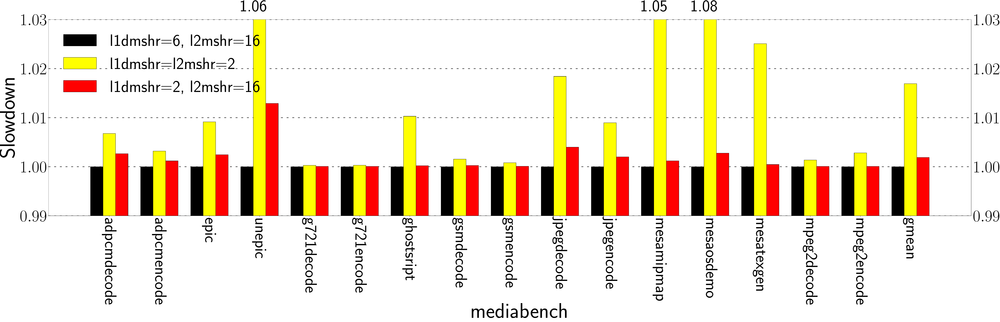

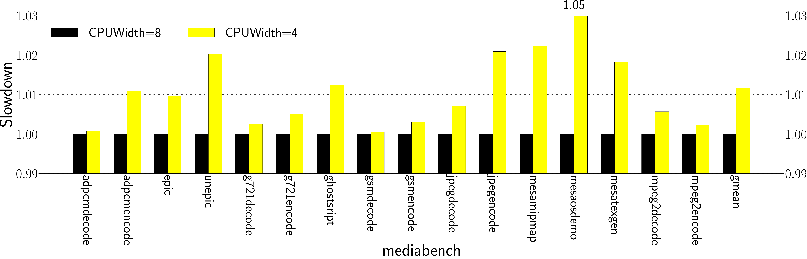

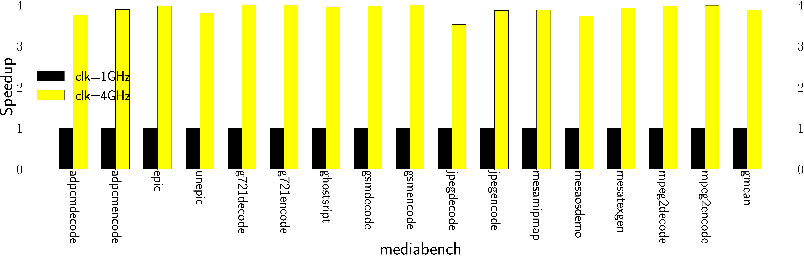

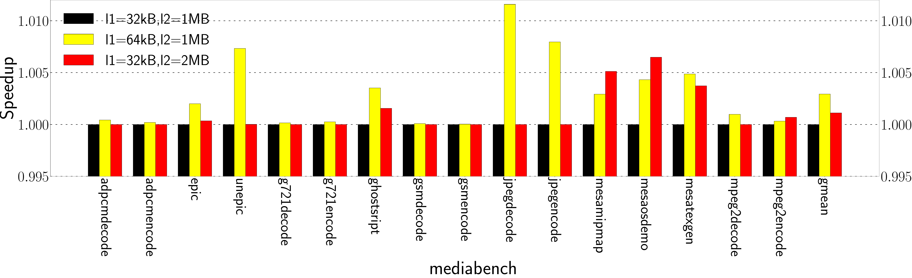

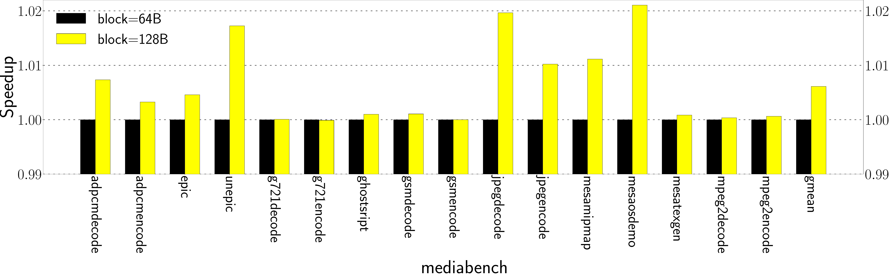

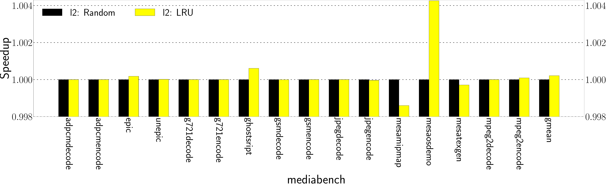

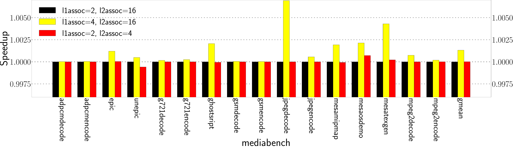

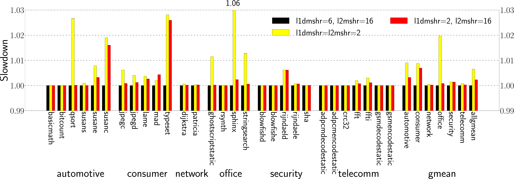

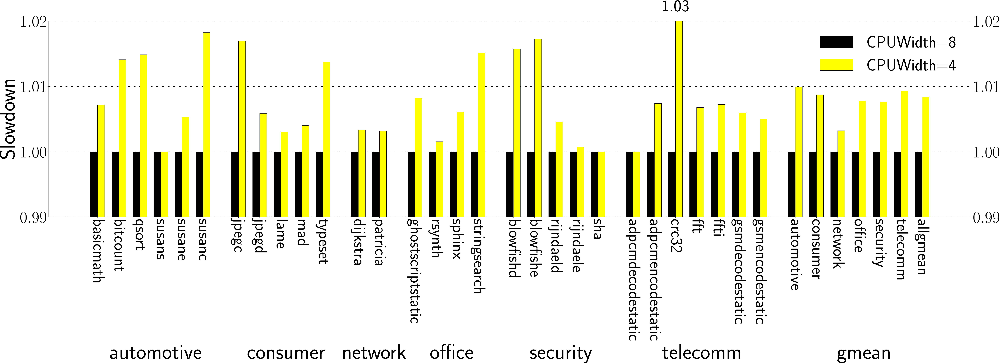

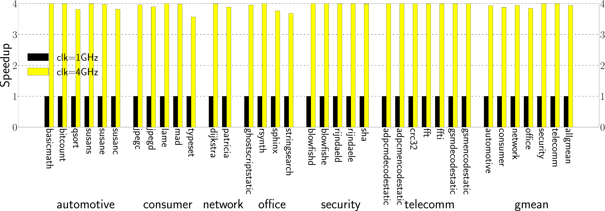

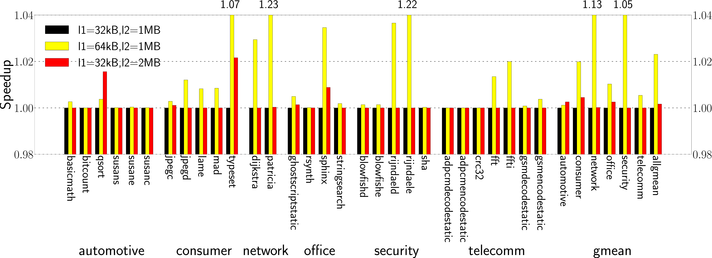

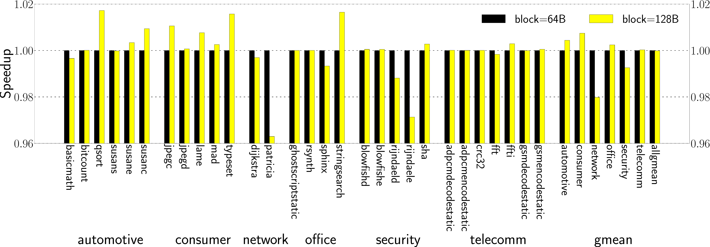

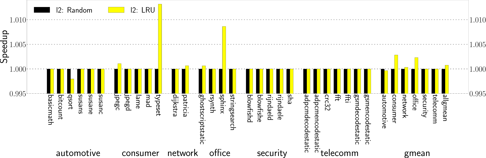

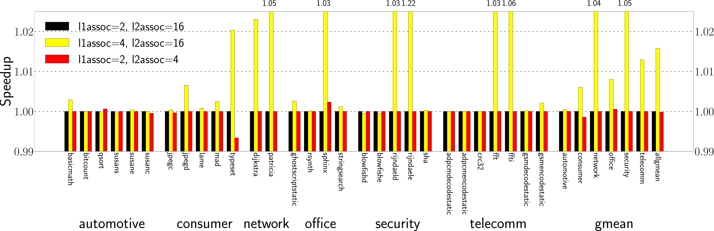
